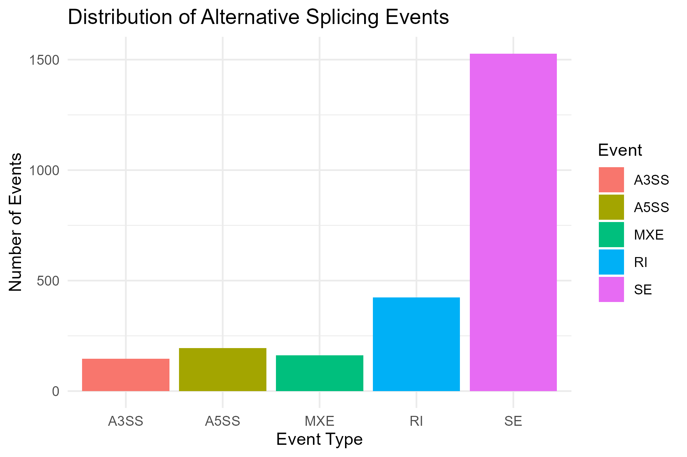
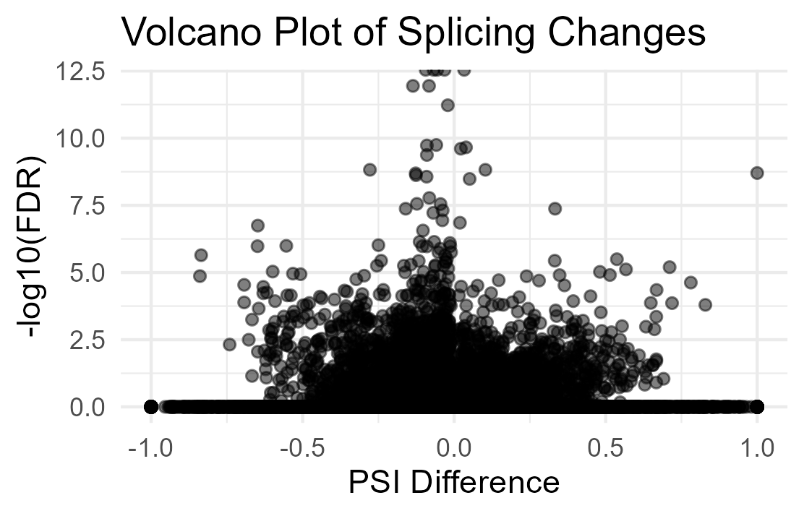
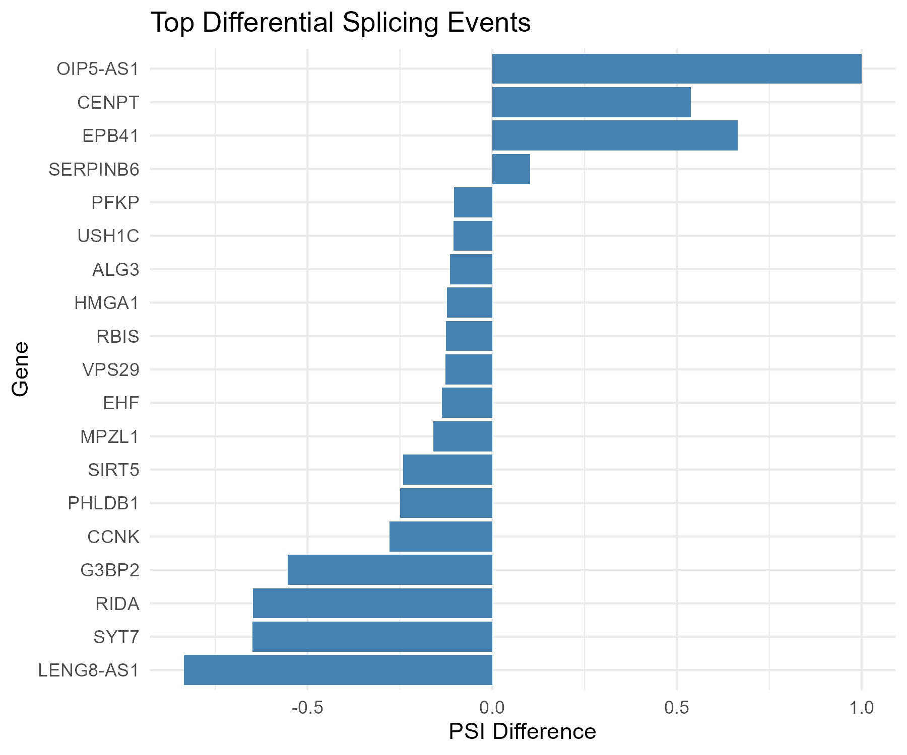
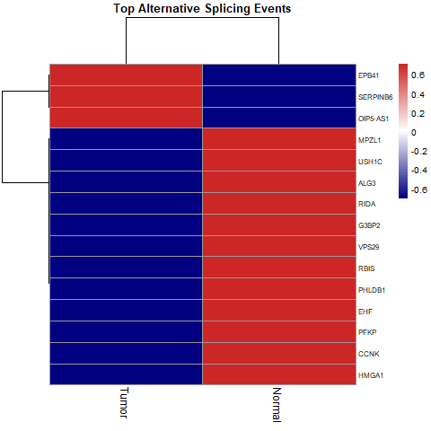
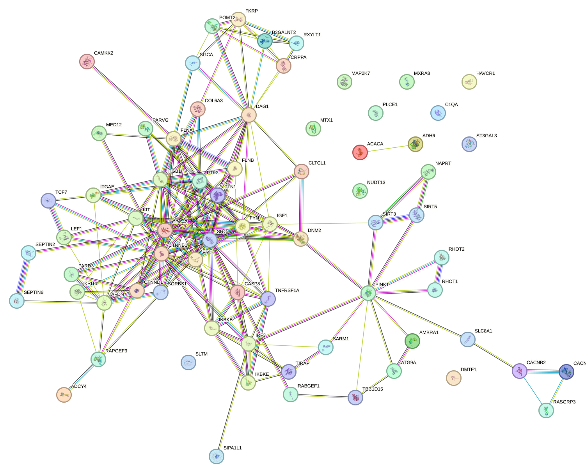

# RNA-seq Alternative Splicing Analysis

## Key Findings

This study investigated differential alternative splicing patterns using RNA-seq data and integrated splicing analysis with functional pathway and network interpretation.

### 1. Exon Skipping is the Most Frequent Splicing Event

Analysis using rMATS identified five types of alternative splicing events. Among them:

• Skipped Exon (SE) events were the most abundant.
• Retained Introns (RI) were the second most frequent.
• Alternative splice site events (A3SS and A5SS) and Mutually Exclusive Exons (MXE) occurred at lower frequencies.

This pattern is consistent with known transcriptomic observations where exon skipping represents the dominant splicing mechanism in eukaryotic genes.

---

### 2. Significant Differential Splicing Between Tumor and Normal Samples

Filtering based on:

• FDR < 0.05
• |ΔPSI| > 0.1

identified genes showing strong changes in exon inclusion levels between tumor and normal conditions.

Examples of genes with notable splicing differences include:

• EPB41
• SERPINB6
• OIP5-AS1
• MPZL1
• HMGA1
• CCNK

These genes are involved in transcription regulation, cytoskeleton organization, and signal transduction.

---

### 3. Differential Splicing Affects Cell Adhesion and Cytoskeleton Pathways

KEGG enrichment analysis revealed that up-spliced genes were significantly associated with pathways related to cell adhesion and cytoskeletal regulation, including:

• Adherens Junction
• Integrin Signaling
• Rap1 Signaling Pathway

Genes such as ITGB1, CTNNB1, SRC, and CDC42 formed a highly connected interaction module in the STRING network, suggesting that alternative splicing may influence cell migration and structural organization.

---

### 4. Mitochondrial Quality Control and Metabolic Pathways Are Affected

Up-spliced genes were also enriched in pathways related to mitochondrial function and metabolism, including:

• Mitophagy
• Nicotinate and Nicotinamide Metabolism
• Mannose Type O-Glycan Biosynthesis

Genes such as PINK1, RHOT1, and AMBRA1 formed a cluster associated with mitochondrial quality control mechanisms.

---

### 5. Down-Spliced Genes Are Associated with DNA Repair and Immune Pathways

Down-spliced genes were enriched in pathways related to genome stability and immune response, including:

• Base Excision Repair
• Antigen Processing and Presentation
• Lipoic Acid Metabolism

Genes such as SMUG1, PNKP, and POLL are involved in DNA damage repair processes.

---

### 6. Protein Interaction Networks Reveal Functional Gene Modules

STRING network analysis identified clusters of interacting proteins involved in:

• cell adhesion signaling
• cytoskeleton regulation
• mitochondrial quality control
• immune response pathways

Highly connected proteins such as ITGB1, SRC, CTNNB1, and CDC42 appear to act as central nodes in the interaction network.

---

## Overall Conclusion

The integrated RNA-seq splicing analysis demonstrates that differential alternative splicing may influence key biological processes including:

• cell adhesion and cytoskeleton organization
• mitochondrial regulation
• metabolic pathways
• DNA repair mechanisms
• immune signaling pathways

These findings highlight the potential functional impact of alternative splicing in reshaping transcriptomic networks associated with disease progression.

---

# RNA-seq Alternative Splicing Analysis Pipeline

```
RNA-seq FASTQ files
        │
        │
        ▼
Quality Control
(FastQC + MultiQC)
        │
        │
        ▼
Read Alignment
(STAR 2-pass alignment)
        │
        │
        ▼
Aligned BAM files
        │
        │
        ▼
Alternative Splicing Detection
(rMATS)
        │
        │
        ▼
Differential Splicing Events
(SE, RI, A5SS, A3SS, MXE)
        │
        │
        ▼
Filtering Significant Events
(FDR < 0.05, |ΔPSI| > 0.1)
        │
        │
        ▼
Gene List Extraction
        │
        │
        ▼
Pathway Enrichment
(KEGG – Enrichr)
        │
        │
        ▼
Network Analysis
(STRING)
        │
        │
        ▼
Biological Interpretation
```

---

# Dataset: GSE50760 – Colorectal Cancer

## Introduction

This project performs an end-to-end bulk RNA-seq analysis to identify transcriptional differences between primary colorectal cancer tissues (Tumor) and normal colon epithelium (Control). Public RNA-seq data from GEO accession GSE50760 were analyzed using a standard RNA-seq workflow including quality control, read trimming, alignment, gene quantification, differential expression analysis, and pathway enrichment.

The goal of this analysis is to identify biological pathways altered in colorectal cancer samples compared to normal tissue.

---

# Dataset Description

The dataset GSE50760 contains RNA-seq samples from colorectal cancer patients.

Study objective (from GEO):
Identify prognostic gene signatures associated with aggressiveness of colorectal cancer.

### Sequencing details

| Property  | Value               |
| --------- | ------------------- |
| Platform  | Illumina HiSeq 2000 |
| Read type | Paired-end          |
| Library   | cDNA                |
| Organism  | Homo sapiens        |

---

# Samples Used in This Analysis

From the dataset, six samples were selected for differential expression analysis.

### Tumor (Primary Colorectal Cancer)

• SRR975551
• SRR975552
• SRR975553

### Normal Colon Tissue

• SRR975569
• SRR975571
• SRR975575

These samples represent tumor tissue vs normal colon epithelium.

---

# Quality Control

Quality control of raw sequencing reads was performed using FastQC.

The FastQC reports were examined to evaluate:

• Per base sequence quality
• GC content distribution
• Adapter contamination
• Sequence duplication levels
• Sequence length distribution

Six RNA-seq samples were analyzed:

### Tumor samples

SRR975551
SRR975552
SRR975553

### Normal samples

SRR975569
SRR975571
SRR975575

---

# FastQC Summary

## Basic Statistics

All samples showed consistent sequencing characteristics:

• Read length: 101 bp
• GC content: ~50–51%
• Sequencing platform: Illumina HiSeq
• Total reads per sample: ~27–41 million reads

These values are typical for bulk RNA-seq experiments and indicate adequate sequencing depth.

---

# Per Base Sequence Quality

The per-base sequence quality plots show the distribution of Phred quality scores across read positions.

Observations:

• High base quality at the beginning of reads (Q30–Q40).
• Gradual decrease in quality toward the 3' end of reads.
• Some bases in the last positions drop into the low-quality region.

This pattern is common in Illumina sequencing datasets due to signal decay over sequencing cycles.

Although FastQC flags this metric as FAIL, it is expected behavior for longer reads (100 bp) and does not necessarily indicate poor sequencing.

---

# GC Content Distribution

GC content across all samples is approximately 50–51%, which is consistent with the expected GC content of the human transcriptome.

The GC distribution does not show abnormal peaks, indicating that the libraries are not strongly biased.

---

# Sequence Length Distribution

All reads have a uniform length of 101 bp, which confirms that sequencing was performed using a fixed-length Illumina read protocol.

---

# Sequence Duplication Levels

Moderate duplication levels were observed.

This is common in RNA-seq datasets because highly expressed transcripts naturally generate many identical reads.

Therefore, duplication in RNA-seq does not necessarily indicate technical artifacts.

---

# Adapter Content

No significant adapter contamination was detected in the raw reads.

However, trimming was still performed to remove potential low-quality bases at read ends.

---

# Quality Control Conclusion

Overall, the sequencing reads show acceptable quality for RNA-seq analysis.

The main observation is a decrease in base quality toward the end of reads, which is typical for Illumina sequencing.

To improve alignment accuracy, reads were processed using fastp to trim low-quality bases and remove potential adapter sequences before downstream analysis.

---

# Read Trimming and Filtering

Raw sequencing reads were processed using fastp (v0.23.4) to remove low-quality bases and potential adapter contamination.

fastp performs:

• Quality filtering
• Adapter trimming
• Removal of reads containing excessive ambiguous bases (N)
• Read length filtering
• Generation of QC reports (HTML and JSON)

This step improves alignment accuracy and downstream expression quantification.

---

# fastp Command Used

```
fastp \
-i SRR975551_1.fastq \
-I SRR975551_2.fastq \
-o SRR975551_trimmed_1.fastq \
-O SRR975551_trimmed_2.fastq \
-h SRR975551_fastp.html \
-j SRR975551_fastp.json \
-w 8
```

The same procedure was applied to all six samples.

---

# fastp Summary Statistics

Across all samples:

• Original read length: 101 bp
• Mean read length after trimming: ~100 bp
• GC content: ~49–51%
• Duplication rate: ~5–8%

These values are typical for RNA-seq libraries.

---

# Quality Improvement After Trimming

Before trimming:

• Q20 bases: ~81–83%
• Q30 bases: ~71–73%

After trimming:

• Q20 bases: ~94–95%
• Q30 bases: ~85–86%

This indicates a substantial improvement in overall sequencing quality.

---

# Filtering Results

Across the six samples:

• ~75–78% of reads passed filtering
• ~21–24% of reads were removed due to low quality
• Reads containing excessive N bases were negligible (~0.03%)
• No reads were discarded due to short length

These results indicate that trimming successfully removed low-quality sequences while retaining the majority of usable reads.

---

# Insert Size Distribution

The insert size peak across samples ranged from 145–166 bp, which is consistent with typical Illumina RNA-seq library preparation protocols.

---

# GC Content

GC content remained stable after filtering (~50%), suggesting that trimming did not introduce sequence bias.

---

# fastp Report Visualization

fastp generates interactive reports that can be opened in a browser.

Example:

```
firefox SRR975551_fastp.html
```

or

```
xdg-open SRR975551_fastp.html
```

These reports include:

• Quality score distribution
• Base content distribution
• Adapter trimming summary
• Insert size distribution
• Duplication rate

---

# Conclusion of Trimming Step

The fastp preprocessing step significantly improved sequencing quality by removing low-quality bases and potential sequencing artifacts.

The majority of reads passed filtering and retained high Q20 and Q30 scores, ensuring reliable downstream analysis including:

• Genome alignment
• Gene quantification
• Differential expression analysis.

---

# RNA-seq Pipeline

1. Quality Control (FastQC)
2. Read Trimming (fastp)
3. Alignment (HISAT2)
4. Gene Quantification (featureCounts)
5. Differential Expression (DESeq2)
6. Pathway Analysis (GSEA)

---

# Genome Alignment Using STAR (Two-Pass Mode)

RNA-seq reads were aligned to the human reference genome (GRCh38) using STAR in two-pass mode, which improves splice junction detection and mapping accuracy.

STAR is a splice-aware aligner optimized for RNA-seq data and capable of mapping reads across exon–exon junctions.

---

# STAR Two-Pass Alignment Strategy

### First Pass

Reads are aligned to the reference genome to identify novel splice junctions.

Output generated:

SJ.out.tab

This file contains all detected splice junctions supported by sequencing reads.

---

### Second Pass

Detected splice junctions are incorporated into the genome index, and reads are re-aligned to improve mapping accuracy.

This allows:

• improved alignment across exon junctions
• detection of novel splicing events
• improved transcript assembly accuracy

---

# STAR Two-Pass Alignment Command

```
STAR \
--genomeDir reference/star_index \
--readFilesIn sample_R1_trimmed.fastq sample_R2_trimmed.fastq \
--runThreadN 8 \
--twopassMode Basic \
--outSAMtype BAM SortedByCoordinate \
--quantMode GeneCounts
```

## Important parameters

| Parameter              | Function                    |
| ---------------------- | --------------------------- |
| --twopassMode Basic    | Enables two-pass alignment  |
| --quantMode GeneCounts | Generates gene counts       |
| --outSAMtype BAM       | Outputs BAM alignment files |

---

# Alignment Output Files

STAR produces several important files:

Aligned.sortedByCoord.out.bam
SJ.out.tab
Log.out
Log.final.out

| File          | Description               |
| ------------- | ------------------------- |
| Aligned BAM   | aligned RNA-seq reads     |
| SJ.out.tab    | splice junctions detected |
| Log.final.out | alignment statistics      |
| Log.out       | run parameters            |

---

# Alignment Quality Summary

Alignment statistics were summarized using MultiQC.

Across six samples, alignment rates ranged between 57% and 70%.

| Sample    | Assigned Reads |
| --------- | -------------- |
| SRR975551 | 69.6%          |
| SRR975552 | 68.7%          |
| SRR975553 | 59.6%          |
| SRR975569 | 63.5%          |
| SRR975571 | 57.5%          |
| SRR975575 | 57.1%          |

Mapping rates above 50% are generally acceptable for RNA-seq datasets, particularly when analyzing complex tissues.

These values indicate successful alignment of the majority of sequencing reads to the human genome.

---

# Sequencing Depth

After filtering, samples contained between 41 million and 64 million reads.

| Sample    | Reads After Filtering |
| --------- | --------------------- |
| SRR975551 | 60.5M                 |
| SRR975552 | 51.3M                 |
| SRR975553 | 41.3M                 |
| SRR975569 | 53.0M                 |
| SRR975571 | 64.2M                 |
| SRR975575 | 57.6M                 |

This sequencing depth is sufficient for:

• transcript quantification
• isoform detection
• alternative splicing analysis

Typical RNA-seq studies require 30–50 million reads per sample, therefore this dataset provides adequate coverage.

---

# GC Content

GC content across samples ranged from:

49% – 51%

This distribution is consistent with the expected GC composition of the human transcriptome and indicates minimal GC bias during sequencing.

---

# Duplication Rates

Duplication levels ranged between:

5.5% – 8.7%

Low duplication rates suggest:

• high library complexity
• minimal PCR amplification bias

Values below 10% duplication are generally considered high quality.

---

# Adapter Contamination

Adapter contamination was very low:

0.7% – 1.7%

This confirms that trimming using fastp successfully removed adapter sequences and low-quality bases.

---

# Splice Junction Detection

STAR detected thousands of splice junctions during alignment.

These splice junctions were stored in:

SJ.out.tab

The identification of exon–exon junctions confirms the presence of active RNA splicing in the dataset and provides the basis for downstream alternative splicing analysis.

---

# Importance of STAR Two-Pass Alignment

The two-pass alignment approach is particularly important for RNA-seq studies because it:

• improves detection of novel splice junctions
• increases alignment accuracy
• improves downstream transcript reconstruction
• enhances alternative splicing analysis

These improvements are critical for tools such as:

• StringTie (transcript assembly)
• rMATS (alternative splicing detection)

---

# Transcript Assembly and Alternative Splicing Analysis

## Transcript Assembly Using StringTie

Transcript assembly was performed using StringTie to reconstruct transcript isoforms from aligned RNA-seq reads.

StringTie assembles transcripts from alignment files and estimates transcript abundances while identifying potential novel isoforms.

---

# Input Files

Aligned reads from six RNA-seq samples were used.

Tumor samples

SRR975551
SRR975552
SRR975553

Normal colon samples

SRR975569
SRR975571
SRR975575

Each sample generated a GTF file containing assembled transcripts.

Example files:

results/stringtie/SRR975551.gtf
results/stringtie/SRR975552.gtf
results/stringtie/SRR975553.gtf
results/stringtie/SRR975569.gtf
results/stringtie/SRR975571.gtf
results/stringtie/SRR975575.gtf

These files were then merged to create a unified transcriptome annotation across all samples.

mergelist

---

# Merging Transcript Assemblies

Individual transcript assemblies were combined using the StringTie merge function to generate a comprehensive transcript annotation.

Command Used

```
stringtie --merge \
-G Homo_sapiens.GRCh38.gtf \
-o merged_transcripts.gtf \
mergelist.txt
```

This produced:

merged_transcripts.gtf

The merged transcript annotation represents all transcript isoforms detected across tumor and normal samples.

---

# Biological Interpretation of StringTie Results

Transcript assembly revealed extensive transcript diversity across the dataset.

Many genes produced multiple transcript isoforms, reflecting the complexity of RNA processing in human cells.

These isoforms arise from mechanisms such as:

• alternative exon usage
• exon skipping
• alternative splice site selection
• intron retention

The merged transcriptome therefore represents the complete set of transcripts detected across the colorectal cancer samples.

---

# Alternative Splicing Analysis Using rMATS

Alternative splicing analysis was performed using rMATS to identify differential splicing events between tumor and normal samples.

rMATS detects splicing events by comparing exon inclusion levels between conditions.

Five classes of alternative splicing events were analyzed:

| Event | Description                |
| ----- | -------------------------- |
| SE    | Skipped exon               |
| A5SS  | Alternative 5' splice site |
| A3SS  | Alternative 3' splice site |
| MXE   | Mutually exclusive exon    |
| RI    | Retained intron            |

---

# Summary of Splicing Events

The number of detected splicing events is summarized below.

summary

| Event Type                        | Significant Events |
| --------------------------------- | ------------------ |
| Skipped exon (SE)                 | 1527               |
| Retained intron (RI)              | 424                |
| Alternative 5' splice site (A5SS) | 195                |
| Mutually exclusive exon (MXE)     | 161                |
| Alternative 3' splice site (A3SS) | 146                |

Skipped exon events were the most frequent splicing alteration, consistent with previous transcriptomic studies showing exon skipping as the dominant alternative splicing mechanism in human genes.

---

# Biological Interpretation of Splicing Events

## Exon Skipping

Skipped exon events accounted for the majority of significant splicing events.

Exon skipping can alter:

• protein domain structure
• transcript stability
• protein–protein interactions

Changes in exon inclusion may therefore produce functionally distinct protein isoforms.

---

## Intron Retention

Retained intron events were the second most frequent splicing alteration.

Intron retention can affect:

• mRNA stability
• nonsense-mediated decay
• protein translation efficiency

These mechanisms may regulate gene expression post-transcriptionally.

---

## Alternative Splice Site Usage

Alternative 3' and 5' splice site events introduce variations in exon boundaries, producing transcripts with modified coding sequences.

Such changes can influence:

• protein domain composition
• regulatory elements within transcripts.

---

# Differential Splicing Between Tumor and Normal Samples

rMATS also reports the direction of exon inclusion differences between sample groups.

Across significant events:

| Direction                  | Number of Events |
| -------------------------- | ---------------- |
| Higher inclusion in tumor  | 419              |
| Higher inclusion in normal | 1108             |

This suggests that normal samples exhibit greater exon inclusion for many transcripts, while tumor samples display altered exon usage patterns.

These findings indicate that alternative splicing contributes to transcriptomic differences between tumor and normal colon tissues.

---

# Alternative Splicing Analysis Results

## Overview

Alternative splicing analysis was performed using rMATS to identify differential exon usage between colorectal tumor and normal samples.

Five major classes of alternative splicing events were analyzed:

| Event Type | Description                |
| ---------- | -------------------------- |
| SE         | Skipped exon               |
| RI         | Retained intron            |
| A5SS       | Alternative 5' splice site |
| A3SS       | Alternative 3' splice site |
| MXE        | Mutually exclusive exon    |

---

# Distribution of Alternative Splicing Events



Skipped exon (SE) events were the most frequent alternative splicing event, followed by retained introns.

Observations

| Event Type | Approx Events |
| ---------- | ------------- |
| SE         | ~1500         |
| RI         | ~400          |
| A5SS       | ~200          |
| MXE        | ~150          |
| A3SS       | ~140          |

Interpretation

Exon skipping dominates the splicing landscape of the dataset.

This observation is consistent with previous transcriptomic studies showing that exon skipping is the most common alternative splicing mechanism in human genes.

High intron retention events suggest potential regulation at the level of RNA stability and transcript degradation.

---

# Differential Splicing Volcano Plot



The volcano plot displays the relationship between:

• PSI difference (ΔPSI)
• statistical significance (−log10 FDR)

Observations

Most splicing events cluster near ΔPSI = 0, indicating moderate splicing differences.

However, several events exhibit strong ΔPSI changes, indicating significant exon inclusion differences between tumor and normal samples.

Interpretation

Significant points represent transcripts undergoing differential exon inclusion, suggesting functional isoform changes between the two biological conditions.

---

# Top Differential Splicing Events



Top genes with significant splicing changes include:

| Gene     | Direction                     |
| -------- | ----------------------------- |
| OIP5-AS1 | higher inclusion              |
| CENPT    | increased exon inclusion      |
| EPB41    | strong positive PSI shift     |
| SERPINB6 | moderate inclusion difference |
| PFKP     | reduced inclusion             |
| USH1C    | reduced inclusion             |

Biological Significance

Several genes involved in:

• cytoskeletal organization
• transcription regulation
• metabolic processes

show altered splicing patterns.

These isoform changes may affect protein structure or regulatory activity.

---

# Heatmap of Alternative Splicing Patterns



The heatmap shows PSI values across tumor and normal samples.

Observations

Clear clustering separates:

• tumor samples
• normal samples

This indicates that splicing patterns differ between conditions.

Genes such as:

• EPB41
• SERPINB6
• PFKP
• HMGA1

show distinct inclusion patterns between tumor and normal tissues.

Interpretation

Distinct clustering suggests that alternative splicing contributes to transcriptional differences between colorectal tumor and normal samples.

---

# Code Used for Visualization

Example R code used to generate the plots.

## Splicing Event Distribution

```
events <- data.frame(
Event=c("A3SS","A5SS","MXE","RI","SE"),
Count=c(146,195,161,424,1527)
)

library(ggplot2)

ggplot(events,aes(x=Event,y=Count,fill=Event))+
geom_bar(stat="identity")+
theme_minimal()+
labs(title="Distribution of Alternative Splicing Events",
x="Event Type",
y="Number of Events")
```

---

## Volcano Plot

```
ggplot(se,aes(x=IncLevelDifference,y=-log10(FDR)))+
geom_point(alpha=0.5)+
theme_minimal()+
labs(title="Volcano Plot of Splicing Changes",
x="PSI Difference",
y="-log10(FDR)")
```

---

## Top Splicing Genes

```
top <- sig_se[order(abs(sig_se$IncLevelDifference),decreasing=TRUE),][1:20,]

ggplot(top,aes(x=reorder(geneSymbol,IncLevelDifference),
y=IncLevelDifference))+
geom_bar(stat="identity")+
coord_flip()+
theme_minimal()
```

---

## Splicing Heatmap

```
library(pheatmap)

heat <- as.matrix(top[,c("IncLevel1","IncLevel2")])

pheatmap(
heat,
scale="row",
color=colorRampPalette(c("blue","white","red"))(100)
)
```
# KEGG Pathway Enrichment Analysis of Differential Splicing Genes

Differential alternative splicing genes identified from the rMATS analysis were separated into up-spliced genes (positive PSI difference) and down-spliced genes (negative PSI difference). These gene sets were subjected to pathway enrichment analysis using the KEGG 2026 database via Enrichr to identify biological pathways potentially impacted by alternative splicing.

---

# 1. Down-Spliced Pathways (Lower Exon Inclusion in Tumor)


The KEGG enrichment results revealed several pathways enriched among genes showing reduced exon inclusion.

## Top enriched pathways

| Pathway                                         | Overlap | P-value |
| ----------------------------------------------- | ------- | ------- |
| Mannose Type O-Glycan Biosynthesis              | 6/23    | 7.8e-4  |
| Adherens Junction                               | 12/92   | 0.0022  |
| Bacterial Invasion of Epithelial Cells          | 10/78   | 0.0057  |
| Integrin Signaling                              | 15/153  | 0.0105  |
| Alcoholic Liver Disease                         | 14/140  | 0.0112  |
| Rap1 Signaling Pathway                          | 18/210  | 0.0199  |
| Arrhythmogenic Right Ventricular Cardiomyopathy | 9/86    | 0.029   |
| Mitophagy                                       | 10/101  | 0.031   |
| Virion / Flavivirus Pathway                     | 2/6     | 0.033   |
| Nicotinate and Nicotinamide Metabolism          | 5/37    | 0.037   |

---

# Biological Interpretation

## Cell adhesion and cytoskeleton regulation

Several enriched pathways such as Adherens junction, Integrin signaling, and Rap1 signaling are strongly involved in cell adhesion and cell migration.

Genes contributing to these pathways include:

• ITGB1
• CTNNB1
• CDC42
• SRC

These pathways regulate cytoskeleton organization and cell–matrix interactions, which are frequently altered in tumor progression. This suggests that alternative splicing may influence tumor cell adhesion and motility.

---

## Protein glycosylation and post-translational modification

The most significant pathway identified was Mannose type O-glycan biosynthesis.

Genes involved include:

• B3GALNT2
• POMT2
• FKRP
• CRPPA
• ST3GAL3

Protein glycosylation plays a critical role in receptor stability, membrane signaling, and protein folding. Alternative splicing of these genes may alter protein glycosylation patterns, thereby influencing cellular signaling networks.

---

## Mitochondrial quality control

The Mitophagy pathway was also enriched.

Key genes include:

• PINK1
• RHOT1
• ATG9A
• AMBRA1

Mitophagy regulates the removal of damaged mitochondria and is associated with metabolic adaptation in cancer cells.

---

## Metabolic regulation

Enrichment of Nicotinate and Nicotinamide metabolism indicates potential changes in NAD⁺ metabolism, which is essential for energy production, redox balance, and DNA repair. Alternative splicing could therefore affect metabolic pathways in tumor cells.

---

# 2. Up-Spliced Pathways (Higher Exon Inclusion in Tumor)


Genes showing increased exon inclusion were enriched in several pathways related to DNA repair, immune response, and cytoskeletal organization.

## Top enriched pathways

| Pathway                                | Overlap | P-value |
| -------------------------------------- | ------- | ------- |
| Base Excision Repair                   | 3/43    | 0.0156  |
| Lipoic Acid Metabolism                 | 2/19    | 0.0222  |
| Shigellosis                            | 7/242   | 0.0299  |
| Dilated Cardiomyopathy                 | 4/103   | 0.0379  |
| Viral Myocarditis                      | 3/68    | 0.0508  |
| Thyroid Hormone Synthesis              | 3/71    | 0.0565  |
| Cytoskeleton in Muscle Cells           | 6/230   | 0.0643  |
| Bacterial Invasion of Epithelial Cells | 3/78    | 0.0708  |
| Antigen Processing and Presentation    | 3/78    | 0.0708  |

---

# Biological Interpretation

## DNA repair pathway disruption

The enrichment of Base Excision Repair suggests that alternative splicing may influence genes involved in genomic maintenance.

Genes involved include:

• SMUG1
• PNKP
• POLL

These genes participate in repairing oxidative DNA damage, indicating that splicing changes may affect DNA repair efficiency.

---

## Immune and infection-related pathways

Several immune-related pathways were enriched, including:

• Shigellosis
• Viral myocarditis
• Antigen processing and presentation

These pathways share genes involved in immune signaling, host defense mechanisms, and inflammatory responses.

Examples include:

• TNFRSF1A
• CDC42
• CD44

This suggests that alternative splicing may influence immune-related signaling pathways.

---

## Cytoskeletal organization

The enrichment of pathways such as Dilated cardiomyopathy and Cytoskeleton in muscle cells reflects involvement of genes controlling cytoskeletal stability and cellular structure.

Genes contributing to these pathways include:

• SGCA
• DAG1
• TLN1
• FMNL3

These genes regulate actin cytoskeleton dynamics and cell morphology.

---

## Metabolic pathways

The enrichment of Lipoic acid metabolism suggests changes in mitochondrial metabolic pathways.

Genes involved include:

• LIPT1
• ACSM1

These genes participate in mitochondrial enzyme activation, indicating potential metabolic alterations.

---

# Key Findings from KEGG Analysis

Overall, pathway enrichment analysis indicates that alternative splicing affects multiple biological processes including:

## Cell adhesion and migration

Adherens junction and integrin signaling pathways were enriched among up-spliced genes.

## Metabolic regulation

Pathways such as nicotinate metabolism and lipoic acid metabolism suggest metabolic remodeling.

## DNA repair mechanisms

Base excision repair enrichment indicates potential impact on genomic stability.

## Mitochondrial function

Mitophagy enrichment suggests regulation of mitochondrial quality control.

## Immune and infection-related pathways

Immune signaling pathways were enriched among down-spliced genes.

---

# Important Note on Adjusted P-values

Although several pathways showed significant nominal p-values, the adjusted p-values were relatively high due to the large gene set used for enrichment and multiple hypothesis correction. Therefore, the results should be interpreted as exploratory functional insights rather than definitive pathway associations.

---

# Biological Conclusion

The analysis indicates that alternative splicing may contribute to functional alterations in pathways regulating cell adhesion, metabolism, mitochondrial homeostasis, immune response, and DNA repair. These findings suggest that transcript isoform changes may play a role in cellular signaling and metabolic reprogramming associated with tumor development.

---

# 1. Up-Spliced Gene Network Interpretation



## Key hub genes in the center

Important nodes visible in your network include:

• ITGB1
• SRC
• CTNNB1
• CDC42
• EGF
• IGF1
• TLN1

These genes are highly connected, suggesting they may function as hub proteins in the interaction network.

---

## Biological Meaning

These hub genes participate in:

### Cell adhesion and cytoskeleton regulation

Important pathways include:

• Adherens junction
• Integrin signaling
• Rap1 signaling

These pathways regulate:

• cell–cell adhesion
• extracellular matrix interaction
• cytoskeleton remodeling

Alternative splicing affecting these genes may therefore influence cell migration and tumor progression.

---

## Mitochondrial quality control

A separate cluster around PINK1, RHOT1, AMBRA1, ATG9A corresponds to the mitophagy pathway.

Mitophagy regulates:

• removal of damaged mitochondria
• cellular stress responses
• metabolic adaptation

Changes in exon inclusion within these genes may influence mitochondrial homeostasis.

---

## Protein glycosylation cluster

Another small module contains:

• POMT2
• B3GALNT2
• FKRP
• CRPPA

These genes participate in glycosylation pathways, which affect:

• receptor stability
• membrane protein modification
• signaling activity.

---

# 2. Down-Spliced Gene Network Interpretation

.png)

The down-spliced gene network is less dense than the up-spliced network.

This suggests that these genes participate in separate functional modules rather than a single central pathway.

---

## Functional Modules Observed

### DNA Repair Module

Genes involved:

• SMUG1
• PNKP
• POLL

These proteins form part of the Base Excision Repair pathway, which repairs oxidative DNA damage.

Reduced exon inclusion in these genes may affect DNA repair efficiency.

---

### Cytoskeleton and Cell Structure Module

Genes include:

• TLN1
• CDC42
• FMNL3
• DAG1

These genes regulate:

• actin cytoskeleton dynamics
• cell morphology
• mechanical stability

---

### Immune Signaling Module

Genes include:

• TNFRSF1A
• RNF31
• CD44

These participate in immune response pathways and inflammatory signaling.

---

### Metabolic Module

Genes include:

• ACSM1
• LIPT1

These are involved in lipoic acid metabolism, a mitochondrial metabolic pathway.

---

# 3. Network-Level Interpretation

Comparing the two networks:

| Network              | Observation                |
| -------------------- | -------------------------- |
| Up-spliced network   | dense central hub          |
| Down-spliced network | smaller functional modules |

This suggests:

• Up-spliced genes form a strongly connected signaling network
• Down-spliced genes affect multiple independent biological processes

---

# 4. Overall Biological Insight

The integrated analysis indicates that alternative splicing may influence several key biological functions:

## Cell adhesion and signaling

Highly connected proteins such as ITGB1, SRC, and CTNNB1 suggest that splicing changes may affect cell adhesion and signaling pathways.

## Cytoskeleton organization

Genes regulating cytoskeletal dynamics appear in both networks, highlighting their role in cellular structure.

## Mitochondrial regulation

The presence of mitophagy-related proteins indicates potential changes in mitochondrial quality control.

## DNA repair and immune pathways

Down-spliced genes are enriched in pathways related to DNA repair and immune response.

